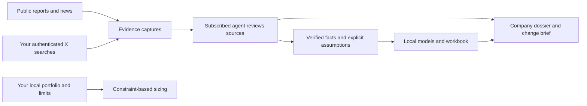
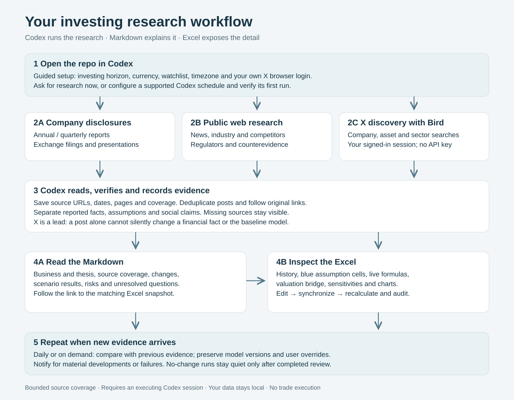

# Investing Research

[](https://github.com/Sethzy/investing-research/actions/workflows/ci.yml)

A standalone investing research workspace for your existing Codex subscription. It searches authenticated X, preserves public reports, calculates financial scenarios locally, and produces readable Markdown and editable Excel. No financial-data, search, X developer, or model API keys are required.

**The agent operates the research; the CLI supplies collection, evidence storage and calculations.** Running `collect` alone does not assess the investment thesis. Open this checkout in your subscribed agent host and ask it to read and follow the local [investing workflow](.agents/skills/investing/SKILL.md). The skill ships in this repository; no separate skill installation is required. Autonomous research runs only while that host session or its supported automation is executing.



The workflow supports watchlists, finite-life mining models, explicit annual cash-flow models, bear/base/bull cases, sensitivities, reverse valuation and portfolio constraints. It does not trade. Metals X (ASX:MLX) is the first research example. Read the **[worked MLX Markdown analysis](examples/mlx/report.md)**, then open its **[detailed Excel workbook](examples/mlx/model.xlsx)** to inspect history, assumptions, formulas and sensitivities. It combines cited issuer history with explicitly illustrative forecasts; it is not a completed valuation or live price target. Other demo model files are synthetic.

Read the [product overview and user journeys](docs/product-overview.md). Download the flow diagram as [SVG](docs/assets/research-flow.svg), [PNG](docs/assets/research-flow.png) or [PDF](docs/assets/research-flow.pdf).



## Install

**Give your Codex coding agent this:**

> Install https://github.com/Sethzy/investing-research as a standalone local workspace. Read its AGENTS.md and follow its bundled setup skill. Interview me about my investing preferences, watchlist and monitoring schedule. Help me connect my own X browser login and test it. Keep anything unfinished clearly marked. Do not ask me for API keys or session cookies.

The agent installs dependencies, asks a short preference interview, resolves your requested companies, checks X, and guides the first research session. You still need to answer the interview and sign in to your own X account. Your agent needs local terminal access; pasting the link into an ordinary chat without local tools cannot install software.

**Or install from a terminal:**

The validated browser-auth platform is **macOS**. Start with Git, **uv**, and **Node.js 22+**. On a Mac with Homebrew, `brew install git uv node` supplies those prerequisites. The installer provisions Python 3.12 and locked dependencies into this checkout.

```sh
git clone https://github.com/Sethzy/investing-research.git
cd investing-research
bash scripts/install.sh
```

The interactive installer starts `invest setup`: currency, horizon, research focus, watchlist, timezone, monitoring time, optional risk limits and X browser profile. Answers stay in ignored local files. Pause with Ctrl-C and resume with `uv run invest setup`; revise with `uv run invest setup --edit`.

Read the **[full setup guide](docs/setup.md)** and **[X login troubleshooting](docs/x-auth.md)**. Linux gets offline CI checks, but live browser authentication on Linux/Windows remains unverified. A saved daily time does not enable monitoring; the agent must configure a supported host scheduler and verify its first run.

For structured PDF/table extraction with local Docling:

```sh
uv sync --locked --extra documents
```

Docling may download public model weights on first use. Baseline public-HTML and PDF text extraction works without that extra. Install LibreOffice and put `soffice` on PATH to synchronize model results into Markdown. Without it, workbook creation and research still work, but no validated Excel-derived model report is published.

Exact Python dependency versions are in [uv.lock](uv.lock); the Bird source and licence ship inside the package. There is no dependency on a personal skills repo, second brain, wiki or QMD.

## Configure your own X session

The setup interview covers this. Sign in to X in your own browser and select the profile containing that login. Chrome's `chrome://version` page shows its profile path. Verify it with:

```sh
uv run invest doctor --live-x
```

`doctor --live-x` should return `x.status: ok`; bounded/capped coverage is expected and is never exhaustive. The OS may ask for browser-cookie/Keychain access. Each recipient authenticates independently and owns their local settings, captures and run receipts. If access fails, follow the [authentication recovery guide](docs/x-auth.md). Never copy another person's ignored configuration or state into a recipient checkout.

Bird uses X's web endpoints and can break when X changes. Its standalone live keyword, date-filtered and exact-post checks are recorded in [X adapter verification](docs/upstream-bird.md). Successful local tests do not establish unattended access in another user's host.

## Run your first research session

In Codex opened at this repo, ask:

> Follow the investing skill. Research ASX:MLX from current public reports and X, attempt three annual and eight quarterly periods, verify ownership and reporting units, and produce a cited dossier. Build a model only from supported inputs and explicit assumptions. Show gaps and pending work.

For a direct collection check:

```sh
uv run invest watch-add examples/company-mlx.json  # only if you want ASX:MLX
uv run invest collect --company asx-mlx
uv run invest status
```

Inspect the returned run ID and `state/review/<run-id>.json`. The agent must read full captures, follow relevant primary links, and submit a decision for **every** candidate before treating the run as reviewed. `pending_review` means unfinished research, not “nothing changed.” Operational failures remain visible even when other sources succeeded.

Detailed runnable commands and JSON contracts are in [workflows](docs/workflows.md), including `review`, `discover`, `fetch`, `browser-capture`, `import-facts`, `recommend`, and portfolio setup.

## Try the local calculations

These commands use synthetic inputs and do not need X authentication:

```sh
uv run invest model examples/model-mine.json
uv run invest scenario examples/model-mine.json --price-multiplier 0.8 --cost-multiplier 1.1 --output private/scenario-mine.json
uv run invest model private/scenario-mine.json
```

With LibreOffice available, the first command prints the validated snapshot location under `companies/demo-mine/models/`. Each run includes `report.md`, its linked `model.xlsx`, `inputs.json` and `model.json`; charts are inside the workbook. The scenario changes base-case commodity price and unit cost across all forecast years, preserving the original file. Read the model's limitations and workbook validation status before using the results.

Read Markdown first; use Excel for the detailed analysis. To edit the MLX example:

```sh
uv run invest excel-create examples/model-mlx.json --output private/mlx-working.xlsx
# Edit blue assumptions in Excel, save, then:
uv run invest excel-sync private/mlx-working.xlsx
```

Synchronization recalculates all three cases, checks them independently, and publishes a new Markdown report linked to its immutable workbook. Later workbook edits are flagged as unsynchronized. New source inputs can be merged with `excel-refresh`, preserving your overrides and recording conflicts. See [Excel and Markdown workflow](docs/excel-models.md).

For your real portfolio, create ignored `private/portfolio.json` and `private/policy.json` following the synthetic examples. Supply your own current observations, trading-session dates and risk limits, then request a target weight:

```sh
uv run invest size asx-mlx 0.10
```

Missing or stale inputs block sizing. A zero-share target position must still include its current quote, currency, FX and sector. Output separates target shares from the incremental change; it does not place an order.

## Update and append research

Research now keeps immutable thesis, catalyst and X-plan revisions. New reports can produce actual-versus-estimate comparisons and old/new model summaries; explicit financing scenarios show funding gaps and dilution. Current Markdown links the retained history. Read the [append-and-update workflow](docs/research-updates.md) and inspect the [published synthetic example](examples/research/demo/README.md).

Try the complete offline synthetic journey (LibreOffice required):

```sh
uv run python scripts/demo-research-updates.py
```

This writes an ignored demonstration workspace and is safe to rerun. It is not an MLX valuation or a live X test.

## Daily monitoring

```sh
uv run invest schedule-prompt
```

Use the printed instruction in your subscribed agent host's supported scheduler, choosing your timezone and time. Test one scheduled run in that host before relying on it. No cron job, paid API fallback or standalone model daemon is installed. The host must be running and able to access the selected browser profile. Notify for material developments, failures or required action; completed no-change runs stay quiet.

## Files and handoff

| Path | Purpose |
|---|---|
| `src/investing_research/` | Small Python application and vendored Bird subset |
| `examples/` | Public configurations, worked MLX example and synthetic demo inputs |
| `.agents/skills/setup/`, `.agents/skills/investing/` | Portable setup interview and research workflows |
| `config/local.json`, `private/` | Your ignored settings, portfolio, policy and working inputs |
| `data/sources/`, `data/extracted/` | Ignored immutable captures and derived text |
| `state/` | Ignored source registry, decisions, facts and run receipts |
| `companies/`, `briefs/` | Ignored generated research and model outputs |
| `docs/`, `tests/` | Design, usage, upstream records and verification |

Share a **clean clone or tracked-files archive**, not a zip of the working directory. Ignored files can contain private research, portfolio data and local settings. Browser sessions and credentials must never be shared. See [upstream decisions](docs/upstream-decisions.md) for what was reused and what remains specific to this project.

## Troubleshooting and checks

- **X authentication fails:** sign in again, check `config/local.json` points at the right profile, resolve any local OS access prompt, then retry `doctor --live-x`. Do not paste cookies into a ticket or chat.
- **Rate limit or upstream failure:** inspect the receipt and retry later. The agent may inspect X through its signed-in browser and preserve the text with `browser-capture`, explicitly reporting that fallback's coverage.
- **PDF text is partial:** inspect the original pages or install the documents extra and use `extract --engine docling`. Image-only pages cannot silently become verified facts.
- **Pending/interrupted runs:** run `status`; finish pending reviews and recollect interrupted coverage. Keep failure receipts.
- **Workbook unverified:** install LibreOffice and ensure `soffice` is discoverable, then run `uv run invest validate-workbook <path-to-model.json>`. This writes a new dated validation record without overwriting the original model snapshot. Rebuild the dossier to show the latest validation. Opening a workbook is not a parity test.

```sh
uv run pytest
uv run ruff check src/investing_research --exclude vendor
```

Read the [implementation specification](docs/superpowers/specs/2026-09-20-investing-research-design.md) for the intended acceptance criteria. Live provider availability, scheduled host execution and another user's browser authentication are separate from deterministic test results.

See the [implementation review and validation record](docs/validation/2026-09-20-implementation-review.md) for live checks, resolved review findings and operational limits.

Project code is MIT licensed; see [third-party notices](THIRD_PARTY_NOTICES.md) for retained upstream attribution. Public CI tests the offline workflows; it has no X account and does not establish live X availability. The MLX example has exercised collection and illustrative modelling, but a completed, decision-grade MLX valuation remains subject to the evidence gaps in the validation record.

## Evidence and report completion

See [the latest MLX review and dated history](examples/mlx/README.md) for the readable PDF and matching Excel. The current edition adds earnings-quality and capital-allocation analysis with a formula-linked Excel Analysis sheet. It retains the dated market quote, shutdown sensitivity, producer comparisons and refreshed X checks. The original workbook remains the formatting reference.

The [KISS specification](docs/specs/2026-09-20-kiss-research-release.md) keeps the workflow focused on material research updates. [Reader publication checks](docs/reader-releases.md) bind each PDF's source report to its reviewed evidence and synchronized Excel snapshot.

Substantive reports distinguish collected sources from reconciled and analyzed evidence. The bundled skill requires dedicated history, valuation, development/funding, industry, X and unresolved-coverage sections. See [the completion workflow](docs/evidence-completion.md). Research refreshes perform new checks; re-exporting preserves the original research dates. Missing inputs remain visible rather than being filled with unsupported estimates.
