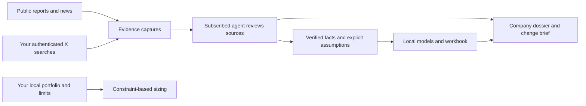

# Investing Research

A standalone investing research workspace for your existing Codex or Claude subscription. It searches authenticated X, preserves public reports, calculates financial scenarios locally, and produces readable Markdown and editable Excel. No financial-data, search, X developer, or model API keys are required.

**The agent operates the research; the CLI supplies collection, evidence storage and calculations.** Running `collect` alone does not assess the investment thesis. Open this checkout in your subscribed agent host and ask it to read and follow the local [investing workflow](.agents/skills/investing/SKILL.md). The skill ships in this repository; no separate skill installation is required. Autonomous research runs only while that host session or its supported automation is executing.



The workflow supports watchlists, finite-life mining models, explicit annual cash-flow models, bear/base/bull cases, sensitivities, reverse valuation and portfolio constraints. It does not trade. Metals X (ASX:MLX) is the first research example; numerical example files use **synthetic figures, not MLX estimates or live prices**.

## Install

The initial supported platform is macOS. Other platforms are unverified. Install **Python 3.12**, **uv**, and **Node.js 22 or newer**, then obtain a clean checkout and run these commands from its root:

```sh
uv sync --locked
uv run invest --help
```

For structured PDF/table extraction with local Docling:

```sh
uv sync --locked --extra documents
```

Docling may download public model weights on first use. Baseline public-HTML and PDF text extraction works without that extra. LibreOffice is optional for running models, but `soffice` must be on PATH to verify workbook recalculation against Python. Without it, parity is explicitly unverified.

Exact Python dependency versions are in [uv.lock](uv.lock); the Bird source and licence ship inside the package. There is no dependency on a personal skills repo, second brain, wiki or QMD.

## Configure your own X session

Sign in to X in your own browser. Select the profile containing that login; `Profile 3` below is **an example**, not a required profile or a shared account. Chrome's `chrome://version` page shows its profile path. Then run:

```sh
uv run invest init --browser chrome --profile 'Profile 3' --timezone Asia/Singapore
uv run invest doctor --live-x
uv run invest watch-add examples/company-mlx.json
```

`init` writes ignored `config/local.json` and does not enable a schedule. Change its browser, profile, timezone and watchlist locally. A second `init` refuses to overwrite existing settings. `doctor --live-x` should return an X status of `ok`; bounded/capped coverage is expected and is never exhaustive. The OS may ask for browser-cookie/Keychain access. Each recipient authenticates independently and owns their local settings, captures and run receipts. Start a fresh recipient checkout with `init`; do not carry another person’s ignored configuration or state into it.

Bird uses X's web endpoints and can break when X changes. Its standalone live keyword, date-filtered and exact-post checks are recorded in [X adapter verification](docs/upstream-bird.md). Successful local tests do not establish unattended access in another user's host.

## Run your first research session

In Codex or Claude opened at this repo, ask:

> Follow the investing skill. Research ASX:MLX from current public reports and X, attempt three annual and eight quarterly periods, verify ownership and reporting units, and produce a cited dossier. Build a model only from supported inputs and explicit assumptions. Show gaps and pending work.

For a direct collection check:

```sh
uv run invest collect --company asx-mlx
uv run invest status
```

Inspect the returned run ID and `state/review/<run-id>.json`. The agent must read full captures, follow relevant primary links, and submit a decision for **every** candidate before treating the run as reviewed. `pending_review` means unfinished research, not “nothing changed.” Operational failures remain visible even when other sources succeeded.

Detailed runnable commands and JSON contracts are in [workflows](docs/workflows.md), including `review`, `discover`, `fetch`, `browser-capture`, `import-facts`, `recommend`, and portfolio setup.

## Try the local calculations

These commands use synthetic inputs and do not need X authentication:

```sh
uv run invest model examples/model-mine.json
uv run invest scenario examples/model-mine.json --price-multiplier 0.8 --cost-multiplier 1.1 --output private/scenario-mine.json
uv run invest model private/scenario-mine.json
```

The first command prints the model output location under `companies/demo-mine/models/`. Each run includes `report.md`, `model.xlsx`, `inputs.json`, `model.json` and a cash-flow chart. The scenario changes base-case commodity price and unit cost across all forecast years, preserving the original file. Read the model's limitations and workbook validation status before using the results.

For your real portfolio, create ignored `private/portfolio.json` and `private/policy.json` following the synthetic examples. Supply your own current observations, trading-session dates and risk limits, then request a target weight:

```sh
uv run invest size asx-mlx 0.10
```

Missing or stale inputs block sizing. A zero-share target position must still include its current quote, currency, FX and sector. Output separates target shares from the incremental change; it does not place an order.

## Daily monitoring

```sh
uv run invest schedule-prompt
```

Use the printed instruction in your subscribed agent host's supported scheduler, choosing your timezone and time. Test one scheduled run in that host before relying on it. No cron job, paid API fallback or standalone model daemon is installed. The host must be running and able to access the selected browser profile. Notify for material developments, failures or required action; completed no-change runs stay quiet.

## Files and handoff

| Path | Purpose |
|---|---|
| `src/investing_research/` | Small Python application and vendored Bird subset |
| `examples/` | Public company configurations and synthetic model/portfolio inputs |
| `.agents/skills/investing/` | Portable host-agent workflow |
| `config/local.json`, `private/` | Your ignored settings, portfolio, policy and working inputs |
| `data/sources/`, `data/extracted/` | Ignored immutable captures and derived text |
| `state/` | Ignored source registry, decisions, facts and run receipts |
| `companies/`, `briefs/` | Ignored generated research and model outputs |
| `docs/`, `tests/` | Design, usage, upstream records and verification |

Share a **clean clone or tracked-files archive**, not a zip of the working directory. Ignored files can contain private research, portfolio data and local settings. Browser sessions and credentials must never be shared. See [upstream decisions](docs/upstream-decisions.md) for what was reused and what remains specific to this project.

## Troubleshooting and checks

- **X authentication fails:** sign in again, check `config/local.json` points at the right profile, resolve any local OS access prompt, then retry `doctor --live-x`. Do not paste cookies into a ticket or chat.
- **Rate limit or upstream failure:** inspect the receipt and retry later. The agent may inspect X through its signed-in browser and preserve the text with `browser-capture`, explicitly reporting that fallback's coverage.
- **PDF text is partial:** inspect the original pages or install the documents extra and use `extract --engine docling`. Image-only pages cannot silently become verified facts.
- **Pending/interrupted runs:** run `status`; finish pending reviews and recollect interrupted coverage. Keep failure receipts.
- **Workbook unverified:** install LibreOffice and ensure `soffice` is discoverable, then run `uv run invest validate-workbook <path-to-model.json>`. This writes a new dated validation record without overwriting the original model snapshot. Rebuild the dossier to show the latest validation. Opening a workbook is not a parity test.

```sh
uv run pytest
uv run ruff check src/investing_research --exclude vendor
```

Read the [implementation specification](docs/superpowers/specs/2026-09-20-investing-research-design.md) for the intended acceptance criteria. Live provider availability, scheduled host execution and another user's browser authentication are separate from deterministic test results.
