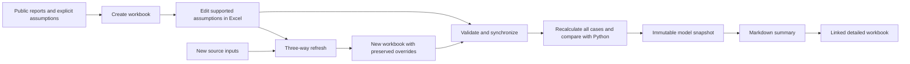

# Excel detail, Markdown research

Read the Markdown research memo for the thesis, evidence, scenarios and limitations. Follow its workbook link for the detailed financial history, editable assumptions, formulas and sensitivities. Both outputs belong to the same validated model snapshot.



## Start with the worked MLX example

Preview the [published Markdown example](../examples/mlx/report.md) and its [detailed workbook](../examples/mlx/model.xlsx).

Complete the [setup guide](setup.md), including Python dependencies. Install LibreOffice and make `soffice` available on your PATH for independent workbook recalculation. Excel is the interactive editing application; LibreOffice is used by the validation workflow. No Office subscription, model API or financial-data API is required to generate and validate workbooks locally.

```sh
uv run invest excel-create examples/model-mlx.json --output private/mlx-working.xlsx
```

Open `private/mlx-working.xlsx` in Excel or LibreOffice. Read the workbook's instructions and limitations before editing. The [MLX model notes](../examples/MLX-MODEL-NOTES.md) explain which inputs are reported facts and which are illustrative assumptions. The historical comparison includes FY2024 and FY2025 issuer financials, alongside selected June 2026 operating observations. It is not a fully integrated three-statement forecast or a completed MLX price target.

Edit the supported assumption cells, save and close the workbook, then synchronize:

```sh
uv run invest excel-sync private/mlx-working.xlsx
```

The command validates the workbook structure and formulas, reads the supported assumption edits, and independently recalculates bear, base and bull cases. It compares the workbook results with Python checks rather than trusting potentially stale cached Excel values. Resolve validation failures before relying on the synchronized output.

A successful sync publishes an immutable model snapshot containing:

| File | Purpose |
|---|---|
| `report.md` | Readable analysis, model outputs, assumptions and limitations, with a relative link to `model.xlsx`. |
| `model.xlsx` | Detailed workbook associated with that snapshot. |
| `inputs.json` | Machine-readable record of the accepted assumptions. |
| `model.json` | Calculation outputs and validation metadata used by the research workflow. |

Use the output location printed by the command. Share the snapshot directory together so the Markdown-to-workbook link continues to work. In a browser, the XLSX link downloads the workbook; a GitHub page does not run Excel calculations.

## What is editable

The workbook is the working copy for supported assumptions after creation. Changing a supported driver such as commodity price changes the dependent formulas. Synchronization brings those changes into the Markdown model report and saved research data.

Formulas and the workbook structure form a versioned calculation contract. Do not overwrite formulas with numbers, rename structural sheets, or insert unsupported forecast logic and then expect automatic acceptance. Such edits need a reviewed model change and regeneration. Rejection is intentional: the software cannot claim independent parity for a formula model different from the one it knows.

Source-linked history should remain attributable. An assumption override is not a newly verified company fact. Keep the source date and interpretation visible, especially when mixing whole-operation mine inputs with consolidated group financial statements.

## Refresh facts without losing your assumptions

Prepare updated source inputs with provenance, then write a new working workbook:

```sh
uv run invest excel-refresh private/mlx-working.xlsx private/mlx-updated-inputs.json --output private/mlx-refreshed.xlsx
```

Refresh compares three versions: the old source baseline, your edited workbook and the incoming source inputs. Unchanged inputs can receive source updates. User overrides are preserved. When both the source and user changed an input, the conflict is recorded for review instead of silently replacing your choice. Read the refresh result before synchronizing the new file:

```sh
uv run invest excel-sync private/mlx-refreshed.xlsx
```

Refresh does not overwrite the original working workbook. Keep it until the new model is accepted. Changed model structures or unsupported edits may require creating a new workbook and deliberately carrying forward reviewed assumptions.

## Keep the memo and workbook aligned

A saved Markdown report is a snapshot, not a live Excel connection. Editing the working workbook does not silently change an existing research memo. Save and synchronize again to publish an updated snapshot. Source hashes support stale-workbook detection; consumers should distinguish the last validated snapshot from later unsynchronized edits.

The research memo should state the model date and validation status, summarize the key outputs and limitations, and link the corresponding detailed workbook. Never present an older snapshot as the result of an unsynchronized workbook edit. Use the normal dossier workflow to refresh company research after accepting a new model snapshot.

## Reading the MLX example responsibly

The model separates historical financial observations from forecast assumptions. Its finite-mine model uses explicit bear/base/bull drivers, ownership adjustments, cash flows, an equity bridge and sensitivities. Reported production is still a proxy for payable sales; imputed tin price is not realized selling price. Mine life, closure and several forecast treatments remain assumptions. The reference quote is missing, so quote-dependent conclusions must remain unavailable rather than becoming invented upside estimates.

Historical balance-sheet and cash reconciliations check the imported figures. They do not establish a complete forecast balance sheet or funding model. Independent Excel/Python parity checks the implementation, not the company's future performance.

The design adapts pinned, attributed [financial modelling references](upstream-excel.md). The detailed upstream guidance ships with this repository; no personal skills repository is needed.

Before delivery, complete the mandatory [workbook financial and visual audit](workbook-quality.md) and record its outcome.
