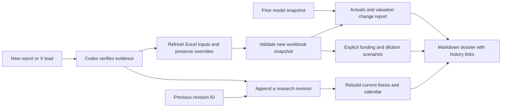

# Research that updates without erasing history

The current dossier is a view. The evidence, thesis revisions, catalyst revisions, source comparisons and model snapshots that support it are retained. Codex appends new records and rebuilds the view. Existing `thesis.md` narrative is never overwritten by these commands.



## 1. Thesis, catalysts and adaptive X plans

Use `research-append` with one JSON revision and `research-history` to retrieve the current IDs and all prior versions:

```sh
uv run invest research-append private/revision.json
uv run invest research-history asx-mlx
```

The first revision has `previous: null`. Later updates must use the latest revision ID for the same company, kind and key. A stale update fails; an exact retry returns the existing record. Never edit or delete old JSON records to change the current view. A correction is another revision with its rationale. Locks serialize CLI writers, each event is written atomically, and derived views can be rebuilt after interruption.

Three typed record kinds are available:

| Kind | Content | Current view |
|---|---|---|
| `pillar` | Claim, expectation, invalidation, status, evidence status and rationale | Original expectation beside current expectation |
| `catalyst` | Event, confirmed/estimated/unknown date, expectation and outcome | Upcoming/overdue/completed/cancelled calendar; all prior dates retained |
| `queries` | One `x-plan` containing at most six searches with intent and rationale | The current plan drives the next collection; each run records its plan revision |

Examples: [synthetic pillar](../examples/research/pillar.json), [synthetic catalyst](../examples/research/catalyst.json), [MLX starting X plan](../examples/research/queries.json). Change the company/date/content to match the actual task. Synthetic examples do not belong in a real investment thesis.

Common fields: `company_id`, `kind`, `key`, `previous`, `as_of`, `rationale`, `source_ids`. Referenced capture IDs must exist. A corroborated pillar or confirmed event date requires at least one complete non-social capture; Codex must still establish that the source actually supports the claim. Unverified X leads remain unverified. An occurred catalyst requires an outcome. Date estimates must never become confirmed just because time passed.

Query plans require at least one contrary-evidence search. Intents are `identity`, `contrary`, `specialist`, `event`, `industry`. Codex authors/refines queries after reading evidence; the CLI does not generate them. Collection supplies date filters and budgets, so plans cannot contain `since:` or `until:`. Plans replace the active search list without changing the original company configuration. Follow primary links and exact posts; verify supported operators before relying on them. Likes are not a truth score.

## 2. Quarterly actuals and model changes

After capturing a report, reviewing facts, refreshing source inputs and synchronizing a new workbook:

```sh
uv run invest model-review private/model-review.json
```

Request shape:

```json
{
  "company_id": "asx-mlx",
  "prior_model": "companies/asx-mlx/models/PRIOR/model.json",
  "updated_model": "companies/asx-mlx/models/UPDATED/model.json",
  "rationale": "Explain what the new report changes and what remains uncertain.",
  "actuals": []
}
```

Replace `PRIOR` and `UPDATED` with actual snapshot paths. Both must pass snapshot verification and match company/currency. The immutable update report lists changed inputs, their rationales, and old/new per-share outputs for all three cases. It links both model reports. It does not claim an additive causal decomposition when multiple inputs change.

For each actual-versus-estimate row supply `fact_id`, `estimate_path` (numeric JSON pointer in prior inputs), `estimate_period`, `scale`, and `rationale`. The imported fact must match company, period, unit, currency and ownership basis and cite a complete non-social source. Its publication date cannot precede the prior model valuation date. A declared valuation date is not independent proof of when a forecast was originally made.

A quarter cannot silently be compared with a full-year estimate. If an annual input is explicitly apportioned, declare the scale and justify it; this is an analyst estimate, not reported quarterly guidance. If no defensible comparison exists, leave `actuals` empty and say so. The command never invents consensus or auto-edits the baseline. A restatement is a new imported fact and new review; the earlier fact remains.

## 3. Funding and dilution

```sh
uv run invest funding-review private/funding-plan.json
```

The plan contains `company_id`, `model` (verified snapshot path), `rationale` and `scenarios` with exactly `bear`, `base`, `bull`. Each scenario supplies one row for every model year: `year`, `interest_rate`, `debt_raised`, `debt_repaid`, `equity_raised`, `issue_price`, `dividends`, `minimum_cash`, `source`, `rationale`. Every financing assumption is explicit; an issue-price assumption is required even in a zero-issuance row to avoid hidden future defaults.

Results include opening/closing cash and debt, interest, share count, ownership dilution and the shortfall versus the cash floor. The formula workbook is independently recalculated against Python before publication. The source model and prior funding scenarios remain unchanged. Repayment cannot exceed opening debt plus explicit new borrowing.

This is a financing overlay, not a fully integrated three-statement forecast or a new equity price target. It uses opening-debt interest and end-period financing, with no interest tax shield, fees or automatic balancing equity. Depreciation, working capital, capex and closure are inherited from the operating model. Underlying share-count and evidence limitations still apply. Negative cash or a positive funding gap is a problem to investigate, not a filled assumption.

The funding JSON is the editable source; changing it produces a new snapshot. Direct edits to the financing workbook are not imported through `excel-sync`. Complete the normal visual audit before delivery. The full integrated three-statement model remains a later modelling extension.

## 4. Research-answer checks

```sh
uv run invest research-eval examples/research/eval-case.json examples/research/eval-answer.json
```

The frozen synthetic rubric checks company identity, numerical claims, units, periods, ownership, exact source/page references, required counterevidence, limitations and permitted conclusions. A failed rubric exits nonzero. These checks evaluate a structured answer; they do not grade narrative reasoning or prove that a cited page supports a claim. Codex/human source review remains required. Add representative captured-source cases after reviewing their expected answers; avoid treating model self-agreement as validation.

## Runnable synthetic journey

```sh
uv run python scripts/demo-research-updates.py
```

Requires LibreOffice. Writes only to ignored `private/research-demo/`: initial thesis, revised thesis, rescheduled catalyst, two model snapshots, model-change report and validated financing workbook. Rerunning preserves the same records. This is a deterministic demonstration, not current MLX research or an X live test.

## Reuse and adaptations

The pinned Anthropic financial-services thesis-tracker, model-update, catalyst-calendar and earnings-analysis reference files are retained verbatim with their Apache licence and SHA-256 provenance. Codex uses the local workflow above; upstream provider assumptions and delivery channels are not activated. Dexter's X-query decomposition and correctness/contradiction evaluation informed the local workflows; no Dexter runtime or evaluator code is copied. No new API keys, external notifications or trading are introduced.
