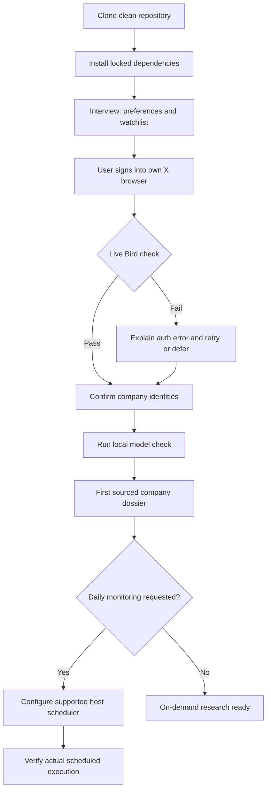

# Setup: from a Git link to your own research workspace

You need a local coding agent with terminal access (Codex), its existing subscription, and your own X browser login. No developer API keys are required. The repository includes the agent instructions and Bird adapter; there is no second-brain, wiki or personal-skills dependency.

## Easiest route: ask your agent to install

Copy this into your local coding agent:

> Install https://github.com/Sethzy/investing-research in a new local folder. Read AGENTS.md and .agents/skills/setup/SKILL.md. Interview me about my investing preferences, configure my watchlist, and guide my own X login. Run the installation, live authentication and synthetic-model checks. Report what works and what still needs me. Set up daily monitoring only if I request it.

The agent can perform installation and checks. You supply your preferences and complete any browser login or OS access prompt yourself.



If X is deferred, public-source research and calculations can continue; the setup summary must keep X coverage marked unavailable.

## Terminal route

On macOS, install Git, uv and Node 22+ through your package manager. With Homebrew already installed:

```sh
brew install git uv node
git clone https://github.com/Sethzy/investing-research.git
cd investing-research
bash scripts/install.sh
```

Otherwise use the official [uv installation instructions](https://docs.astral.sh/uv/getting-started/installation/) and [Node downloads](https://nodejs.org/en/download). The installer checks prerequisites and lets uv obtain Python 3.12 automatically. It does not install a package manager or ask for credentials. Running it twice is safe; locked dependencies are reused and the interview resumes.

In a noninteractive terminal, installation stops after dependencies and prints the next step. Start the interview in an interactive terminal:

```sh
uv run invest setup
```

Use `--edit` to change previous answers. Use `--skip-x` to explicitly defer the live connection check. Neither option enables trading or creates an automation.

## What the interview asks

| Question | How it is used |
|---|---|
| Codex | Automatically selected; no agent-host question |
| Base currency | Portfolio reporting preference; never a silent currency conversion |
| Investment horizon | Frame thesis, catalysts and model assumptions |
| Research style and priorities | Focus the agent's investigation, for example fundamental value and mining |
| Companies and exchanges | Requests for identity verification; an ambiguous ticker is not automatically added |
| Timezone and daily time | Scheduling preference; blank daily time means on-demand only |
| Optional position/cash limits | Explicit preferences for later policy setup; missing limits remain unspecified |
| X browser and profile | Select your own signed-in session for the live Bird check |

The terminal saves answers after each question, so Ctrl-C does not discard progress. It keeps existing confirmed companies and monitoring budgets. `private/preferences.json` stores preferences; `config/local.json` stores browser, timezone and confirmed companies. Both are ignored by Git. The host reads the preference file before research.

Risk answers alone do not enable sizing. Actual holdings, cash, current quotes/FX, freshness dates, sector limits and exclusions are needed in the local portfolio/policy files described in [workflows](workflows.md). Do not copy the synthetic portfolio example as your real account.

## Agent-led interview contract

For a conversational interview, the agent gathers the answers in chat, writes an ignored `private/setup-answers.json`, then runs:

```sh
uv run invest setup --answers private/setup-answers.json
```

This mode validates all answers before writing settings and makes one live X attempt without terminal prompts. Add `--skip-x` only when the user has deferred X. Check the returned status: exit success means the answers were saved; `x_setup_pending` still requires action. A successful live check does not imply that company identities or scheduling are complete.

All eleven keys below are required. This is a **schema example**, not a recipient's preferences; use their answers. Nullable answers must be explicit `null`; a blank watchlist is `[]`. JSON risk weights are fractions (the terminal interview asks percentages). Unknown keys are rejected, including credential fields.

```json
{
  "host": "codex",
  "base_currency": "AUD",
  "horizon": "3–5 years",
  "research_style": "Fundamental value, mining",
  "watchlist_requests": ["ASX:MLX"],
  "timezone": "Asia/Singapore",
  "daily_time": null,
  "max_position_weight": null,
  "minimum_cash_weight": null,
  "browser": "chrome",
  "profile": "Default"
}
```

`host` defaults to `codex` and needs no interview question; currencies are three uppercase letters; `timezone` is an IANA name; `daily_time` is `HH:MM` or null; risk weights are between zero and one or null. Browser accepts `chrome`, `brave`, `edge`, or `firefox`. Profile is a string or null; an explicit Firefox profile must be an absolute directory path. Existing companies and collection budgets are preserved. Providing `--answers` explicitly replaces the saved interview answers, so load existing preferences and ask only for requested changes when helping a returning user.

## X login

Sign into X in your own browser. Find its profile path, enter it in setup, and run:

```sh
uv run invest doctor --live-x
```

Require `x.status: ok` before reporting Bird as working. Missing/expired credentials, rate limits and upstream changes are distinct failures. The detailed [X authentication guide](x-auth.md) explains browser selection, OS prompts, recovery and scheduled-access issues. Never paste cookies, passwords or tokens into the interview or chat.

## First company and model checks

After the agent confirms the ticker/exchange and official sources, it adds a company using `watch-add`. If you choose Metals X specifically:

```sh
uv run invest watch-add examples/company-mlx.json
uv run invest collect --company asx-mlx
uv run invest status
uv run invest model examples/model-mine.json
```

Collection creates a review packet; `pending_review` means the agent still needs to investigate and classify every candidate. The example model uses synthetic data and proves only the calculation/export path. With LibreOffice available, it produces a Markdown report linked to its detailed Excel workbook, with charts inside. Install LibreOffice and put `soffice` on PATH for independent recalculation. Without it, only an editable, unverified working workbook is created; synchronize after installing the engine to publish results. See [Excel and Markdown](excel-models.md) for editing and refresh commands. The optional `uv sync --locked --extra documents` adds Docling for local structured PDF extraction.

Then ask your agent:

> Follow the investing skill and my saved preferences. Research my first confirmed company, capture current public reports, verify material X claims, and produce a cited dossier with diagrams. Show unsupported valuation inputs and other coverage gaps explicitly.

## Daily monitoring

Ask the agent to use your host's supported scheduler at your chosen local time. `uv run invest schedule-prompt` prints the research instruction. A preference saved in a file does not create a job, and this CLI does not run a background reasoning service. Host availability, usage limits and session access still apply.

Require a real scheduled run before trusting unattended operation. Healthy evidence is a completed reviewed receipt and updated dossier, with explicit coverage limits. `pending_review`, interrupted collection, auth errors and no receipt are failures or unfinished work. Keep no-change runs quiet; surface material developments, execution failures and required action.

## Setup completion checklist

- Locked dependency install and `invest --help` succeed.
- Your preferences are saved, and requested company identities are confirmed or explicitly pending.
- A current live X check passes, or X is clearly marked deferred/blocked.
- The synthetic model produces its report and workbook; independent recalculation status is stated.
- Your first research run is reviewed, or its pending work is visible.
- Daily monitoring is either not requested, pending configuration/verification, or verified by an actual scheduled run.

The agent writes a local `private/setup-summary.md` with these outcomes. Only share the Git link or a clean clone. Do not send the working folder: it contains ignored personal settings, research and potentially portfolio information.

## Updating and removing

From a clean source checkout, run `git pull --ff-only` then `bash scripts/install.sh --no-interview`. Existing ignored preferences and research remain local. Recheck X after updates. Review any local source changes before pulling; do not discard them to force an update.

To stop monitoring, disable its job in your host. To remove the local application, first save any research you want, then remove its checkout and virtual environment. Removing a folder does not disable a host automation or sign you out of X.
