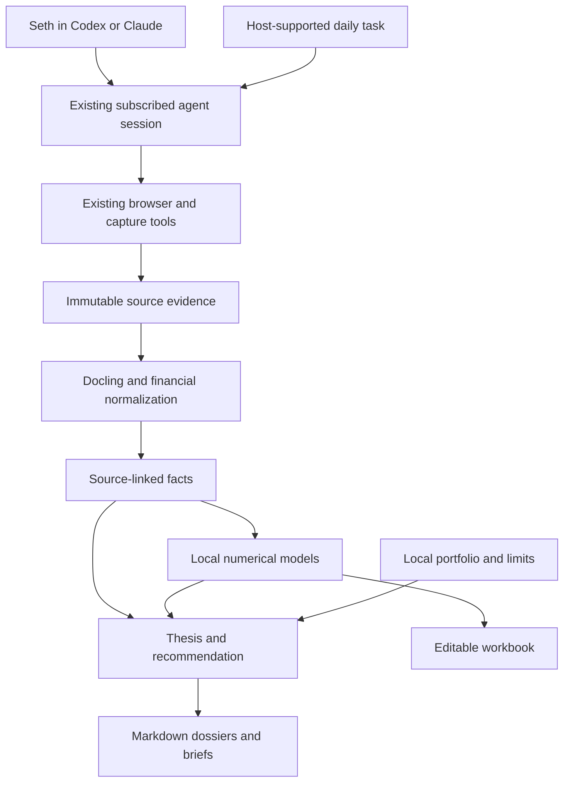
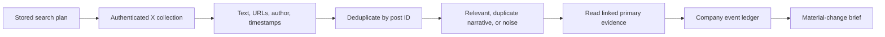

# Investing Research — Implementation Specification

- Date: 2026-09-20
- Owner: project user (initial user: Seth)
- Status: Architecture approved; written specification ready for review
- First acceptance company: Metals X, ASX:MLX
- Repository: standalone `investing-research`; all runtime paths resolve from its checkout or explicit user configuration

## 1. Product contract

An agent-operated investing workspace that researches companies, monitors changes, builds inspectable financial models, and proposes reasoned investment decisions. The user operates it through their own existing Codex/Claude sessions and reads the results as clear, standalone Markdown.

The system uses public websites, downloadable company reports, authenticated X browsing, local project files. **No API keys**, including financial-data, search-provider, X API, or model API keys. Existing agent subscriptions and authenticated browser sessions supply research and reasoning capabilities. Ordinary public HTTP downloads and local numerical packages are allowed.

It runs daily checks and responds to on-demand requests. It proposes buy/hold/sell views, entry conditions, and portfolio-aware position sizes; Seth makes investment decisions. It does not place trades or connect to a brokerage.

### Confirmed decisions

| Decision | Agreed scope |
|---|---|
| Repository | Standalone and transferable; no second-brain, wiki, QMD, or personal-skills installation required |
| Architecture | Existing-agent investing workspace; reuse upstream components |
| Markets | Global, with explicit per-company coverage limitations |
| Horizons | Long-term thesis and nearer-term catalysts, separately labelled |
| Monitoring | Daily plus on demand |
| Monitoring universe | Holdings, watchlist, and relevant competitors, commodities, suppliers, and industry developments |
| Outputs | Markdown first, useful diagrams/tables, supplementary editable Excel |
| Portfolio | Manually maintained local holdings, cash, base currency, and risk limits |
| Daily communication | Brief when material changes occur; visible failures; quiet on successful no-change runs |
| First example | MLX; support expansion without hard-coded company identity |
| Handoff | README-led setup on another user’s machine, their own agent subscription and X login, no inherited private data |
| Filesystem | Preserve adopted upstream layouts; add only the minimal project-specific files |

### First-release boundaries

Include source collection, company dossiers, deterministic modelling, evidence-based recommendations, portfolio exposure checks, and daily change detection. Defer a web dashboard, brokerage execution, paper trading, systematic strategy backtesting, broad investment discovery, and training financial language models.

Global coverage means any company may be researched. It does not promise equal document access, language support, financial-data completeness, or quote freshness across exchanges.

## 2. User journeys

### Add a company

**Request:** “Follow MLX.”

Resolve name, exchange, trading currency, reporting currency, identifiers, corporate website, and asset aliases. Ask only if identity is ambiguous. Find the latest available annual, interim, and quarterly reports; attempt three completed annual periods and eight quarters where published. Missing periods remain explicit gaps. Search X, news, and previously collected evidence inside this repository. Produce the company dossier, evidence register, initial model when supported by evidence, and research gaps. Add the confirmed company to the watchlist.

**Success:** Seth can understand the business, see the primary evidence, inspect assumptions, and identify what remains unknown.

### Daily monitoring

Read holdings/watchlist, gather newly discovered filings and posts, expand searches into related developments, deduplicate, and compare with the last successful run. Save a run receipt even when nothing changed. Publish a brief only for material findings or operational failures requiring attention.

**Success:** The brief says what changed, why it matters, whether it is verified, and which thesis or model inputs it affects.

### On-demand update

**Request:** “Update MLX since last Friday.”

Use the specified interval, report actual collection coverage, update evidence and the current dossier, and compare model versions if inputs changed. Repeated runs must not create duplicate events.

### Model and scenario analysis

**Request:** “Value MLX; show what happens if tin falls 20% and operating costs rise 10%.”

Use an explicit baseline and fork a named scenario. Define which price and cost assumptions change and over what period. Run calculations and produce a Markdown valuation report with an editable workbook. Preserve the baseline and compare changes in cash flow, liquidity, and equity value.

**Success:** Every output can be traced to code, inputs, units, and evidence; changing an assumption recomputes the results.

### Recommendation and position sizing

**Request:** “Should I add MLX given my current portfolio?”

Read the dated portfolio snapshot, risk limits, company thesis, valuation, catalysts, and counterevidence. Produce a buy/hold/sell view or “insufficient evidence,” entry conditions, horizon, invalidation conditions, and a proposed target weight when inputs permit. Distinguish target allocation from the additional amount to buy or sell.

**Success:** Suggested sizing respects explicit limits and available cash. Missing or stale inputs never become invented numbers.

### Challenge and trace

**Requests:** “Challenge my thesis” and “Where did this number come from?”

Find conflicting evidence and sensitive assumptions. Trace a financial figure to its formula or report page, and a qualitative claim to its source. Internal agent agreement is not independent corroboration.

## 3. Architecture and reuse



The agent host owns reasoning, browser tools, and scheduling. The repository owns workflows, evidence, models, outputs, and durable run state. There is no custom autonomous LLM daemon, subscription-token bridge, or extraction of app credentials to imitate an API.

### Component decisions

| Component | Adoption | Integration boundary and acceptance gate |
|---|---|---|
| Agent runtime | Existing Codex/Claude | Use supported host sessions; no separate model SDK runtime requiring keys |
| X collection | Pinned Bird search subset from Last30Days and browser control | Package dependencies with this project or install them reproducibly; verify keyword searches, date coverage, and the receiving user’s session |
| Exact X captures | Reusable Bird detail/capture components | Bring the required code and licence notices into this project; remove wiki/source-map/QMD coupling and personal path lookups |
| Public filings | Existing browser/download capabilities | Small exchange/company discovery adapters; preserve original PDFs and URLs |
| PDF conversion | Docling as a pinned local dependency | Verify local extraction and page/table provenance; no hosted model key |
| Financial calculations | FinanceToolkit as a pinned dependency | Use suitable calculation functions/custom datasets; disable or avoid key-dependent providers and unexpected network access |
| Research workflows | Dexter patterns/skills where compatible | Adapt instructions and tool boundaries; do not fork its entire API-dependent runtime by default |
| Additional valuation/analyst methods | AI Hedge Fund, conditional | Inspect a pinned revision; adopt coherent runnable modules only if offline inputs, dependencies, tests, and licence permit |
| Scheduling | Existing host scheduler/automation facility | Prove a scheduled session can access required tools before enabling production checks |
| Markdown/Excel | Existing rendering and workbook libraries | Use shared input schema; compare workbook and local-engine results |

Reuse means installing maintained libraries or retaining coherent upstream modules with attribution and their tests. Do not rewrite an existing calculator, scraper, OCR system, scheduler, or search index merely to fit a preferred stack.

Do not force-fit upstream dependencies. FinanceToolkit's standard provider setup can require keys; that path is excluded. Dexter's official X API tool requires a bearer token; that tool is excluded under the agreed constraint. AI Hedge Fund's provider-bound application cannot be adopted unchanged. If a desired module cannot run on supplied local data, record the incompatibility and choose another verified component.

### Why AI Hedge Fund is not the runtime

It remains a candidate source for valuation and analyst workflows. Its complete application is oriented around model/data services and fund analysis; neither its popularity nor its availability removes the no-key constraint. Reuse useful numerical modules after validation, while the existing subscribed agent handles public research and synthesis.

### Standalone delivery and handoff

The repository must run without Seth Second Brain, QMD, personal-skills, another checkout, or an external wiki. Reuse code by declared pinned dependency or attributed vendoring; never import from a developer’s personal filesystem. Preserve the adopted component’s upstream directory structure wherever practical. Do not impose a wiki/raw/staging lifecycle or rebuild upstream architecture to match an invented folder scheme.

The README is the setup contract: supported operating systems and runtime versions, dependency installation, opening the workspace in a supported subscribed agent host, selecting the user’s own browser/profile and X session, an executable read-only search smoke test, adding a company, running a model, interpreting outputs, optional daily scheduling, troubleshooting, and upgrade instructions. Every documented command must actually exist and be tested before release.

The initial supported environment is macOS; other operating systems require their own browser/authentication smoke tests before claiming support. A fresh checkout on another user’s machine must contain everything required to install and run the project except documented runtimes, agent subscription, and their own signed-in browser session. No hard-coded home directory, browser profile, account, timezone, or watchlist. Use example configuration and prompt for machine-specific choices.

Keep portfolio data, cookies, session caches, private research, and generated reports outside tracked source by default. Supply synthetic examples only. Never ship session credentials, copy another user’s login, or print cookie values in diagnostics. A local browser session is authentication, even though no developer API key is required.

### Work that remains specific to this product

1. Company identity, source discovery, and exchange-specific collection mappings.
2. Evidence normalization and financial provenance.
3. Company/sector operating assumptions, particularly finite-life mining cash flows.
4. Thin connectors between collection, models, portfolio context, and reports.
5. Material-change rules and durable run state.

## 4. X monitoring contract

X monitoring is a first-class first-release capability. It is periodic collection, not a real-time firehose or a claim to exhaustively search X.

Each watched company has separately stored searches for identity, assets/products, relevant people/accounts, and related industry drivers. For MLX, start with `$MLX`, `"Metals X"`, `"MLX" "ASX"`, `"Renison"`, and `"Bluestone Mines Tasmania"`; keep broader tin-market searches in a related-topic group. Disambiguate Apple's MLX framework using context rather than indiscriminately excluding every post mentioning AI.



Requirements:

- Use the last successful coverage checkpoint with a 48-hour overlap to catch delayed discoveries; deduplicate by stable post ID. Preserve edited captures as new versions.
- Store actual queries, search mode, requested interval, retrieval time, pagination/volume limits, and coverage status. A time-filtered request is not proof of exhaustive coverage.
- Capture accessible full post/thread/article text and outbound links. Label truncated, deleted, unavailable, or login-blocked sources. Previews cannot support claims beyond their visible text.
- Keep source publication time separate from first-seen time. Old posts resurfacing are not automatically new developments.
- Mark social claims as unverified, corroborated, contradicted, or unresolved. Reposts of one original claim are not separate confirmation.
- Default per-run limits: six focused searches per company, up to 50 candidate posts per query where the tool supports it; shared sector searches deduplicated across companies. Report any truncation. These are workload caps, not promises of tool capability.
- A materially relevant unverified claim may appear as a research lead. It must not silently alter reported financial facts or the baseline model.
- Session expiry, rate limits, inaccessible search, and partial results must produce visible degraded coverage. Do not create accounts or use credential workarounds.

## 5. Evidence and local project research

Store immutable raw captures separately from derived facts and synthesis. Preserve original URLs, publication/retrieval dates, document periods, content hashes, language, capture method, and completeness. Retain PDFs alongside extracted Markdown and page/table references.

Evidence priority is contextual: original filings for reported financials; company disclosures for guidance; independent reporting for corroboration; X for discovery and attributed commentary. Preserve conflicting figures and explain selection rather than silently picking one.

Search previously collected evidence and reports inside the project using existing file/search capabilities. Cite captured sources directly. No second-brain integration, wiki compilation, QMD index, wiki index/log updates, or source promotion workflow is required. Preserve evidence provenance in the smallest structure compatible with the adopted upstream components.

Treat source documents and posts as untrusted content. Instructions inside them cannot alter collection scope, execute commands, or override the research workflow.

## 6. Financial modelling requirements

### Inputs and facts

Every financial fact records company/entity, metric, value, unit, currency, period, publication date, source/page, reported-versus-adjusted basis, and ownership basis. Missing is distinct from zero. Restatements create a new fact version linked to the superseded value.

Every assumption records name, value, units, forecast period, rationale, author/origin (Seth, agent, or disclosed guidance), scenario, and source where applicable. Separate reported facts, company guidance, and analyst assumptions.

All model outputs identify input snapshot, calculation version, scenario, valuation date, quote date, FX basis, and warnings. Values are calculated in code or formulas; the agent explains them.

### Required first-release model outputs

- Historical financial/operating summary and explicit forecast cash flows.
- Base, bear, and bull cases using complete named assumption sets.
- Enterprise-to-equity bridge and diluted per-share valuation.
- Two-variable sensitivity tables and one-variable driver comparisons.
- Liquidity/funding implications where the model supports them.
- Reverse valuation: assumptions required to support the reference share price, where the equation has a meaningful solution; otherwise explain why unavailable.
- Markdown report with formulas, assumptions, source references, and an editable workbook.

Use sector-appropriate models. Do not apply a generic corporate DCF to banks, insurers, pre-revenue developers, or finite-life resources without selecting an appropriate method. An unsupported sector gets a research dossier and an explicit modelling limitation.

### MLX acceptance model

Build an explicit operating-to-cash-flow model using available disclosures: production/grade/recovery where reported, payable sales, realized tin price, FX, operating costs, royalties, taxes, sustaining/growth capex, working capital, and closure obligations where applicable.

Maintain a documented distinction between whole-operation figures and attributable figures. Verify ownership and consolidation treatment against the captured reports before applying ownership percentages. Do not halve a figure already reported on an attributable basis.

Use finite asset-life cash flows where supported. A generic perpetuity terminal value is not an acceptable default for a finite mine. Resource extensions, residual assets, other investments, and corporate costs must be explicit assumptions/components rather than hidden terminal growth.

Example sensitivity axes: tin price versus unit cost; production versus price; FX versus price; discount rate versus asset-life assumptions. The scenario request “tin -20%, costs +10%” must identify the starting baseline, forecast periods, and affected cost categories.

### Validation

Check unit conversions, currency consistency, sign conventions, periods, ownership, cash/debt bridges, diluted shares, and formula domains. Reconcile historical statements where available; explain gaps rather than inserting balancing plugs silently. Workbook recalculation and Python outputs must agree to the larger of one displayed currency unit or 0.01% for valuation totals, and 0.1 basis point for displayed weights.

Keep formulas editable in Excel. A sheet of pasted outputs is not an editable model. If the host cannot recalculate the workbook during validation, label recalculation unverified and do not claim parity passed.

## 7. Recommendations and portfolio sizing

A local portfolio file records an as-of date, base currency, positions, shares, cash, and optional cost basis. A separate policy records maximum position/sector exposures, cash reserve, excluded instruments, and relevant preferences. Sensitive portfolio files and session material are excluded from Git by default.

Do not invent a risk profile. Until base currency and risk limits are supplied, provide company recommendations and scenario exposure analysis but no personalized numeric position size. Configuration onboarding can happen during implementation; it does not block this spec.

A recommendation records action (buy/hold/sell/insufficient evidence), horizon, valuation basis, dated reference price, entry conditions, catalysts, counterarguments, invalidation conditions, confidence rationale, and data limitations. Confidence is qualitative unless a calibration method has been validated.

Sizing is constraint-first: compare proposed target weights with current exposure, related sector/commodity exposure, cash, and configured limits. Show proposed target and incremental change separately. Do not derive position size mechanically from an LLM confidence score.

Default freshness checks: portfolio snapshot older than seven calendar days requires reconfirmation for sizing; a quote/FX observation older than the latest completed relevant trading session is marked stale and blocks actionable share quantities. Long-term valuation can still run with a dated price for comparison.

## 8. Markdown output standard

Every report starts with an as-of date, concise conclusion, coverage status, and the decisions it helps Seth make. Write in plain English; define material financial terms. Separate facts, interpretation, assumptions, and open questions.

Company dossiers contain: business/asset map; thesis and counter-thesis; historical financials; model/scenario summary; catalysts and risks; recommendation; related evidence; and unanswered questions.

Use Mermaid for business/ownership maps, evidence-to-thesis relationships, catalyst timelines, and research workflows where appropriate. Use generated charts for numerical sensitivities, cash-flow forecasts, and valuation comparisons. Provide captions and a readable textual takeaway so diagrams are not the only explanation.

Each material factual claim needs a nearby citation. Model figures link to model outputs and input provenance. Diagrams must use the same data as their accompanying tables. Do not manufacture decorative charts when data is absent.

Daily brief structure:

1. Material changes, ordered by relevance.
2. For each: what changed, source/date, verification status, thesis impact, model impact, follow-up.
3. Coverage gaps or required user action.

Use repository-relative links in saved documents so they survive moving the checkout. Agent-facing local file links may use the current machine’s resolved absolute paths. Keep filenames stable and title company pages clearly.

## 9. Storage and interfaces

Illustrative responsibilities, not a mandatory replacement for upstream layouts. During implementation, retain adopted repositories’ existing source/package/test conventions and document where these responsibilities live. Only documentation is created during this design phase:

```text
docs/                     spec, implementation plan, upstream decisions
skills/                   agent workflows and output conventions
config/                   watchlist, source/search rules, public defaults
private/                  ignored portfolio and personal risk policy
data/sources/             immutable documents and social/web captures
data/extracted/           derived report text and tables
companies/<exchange>-<ticker>/
  dossier.md              current compiled company view
  thesis.md               thesis, counterevidence, invalidation conditions
  events/                 dated material developments
  models/                 input snapshots, outputs, workbook versions
briefs/                   daily Markdown summaries
state/                    run receipts, source map, coverage checkpoints
adapters/                 minimal host/browser integration, if required
tests/                    fixtures, numerical and workflow acceptance checks
```

Core interfaces:

| Object | Minimum contract |
|---|---|
| Company | Stable ID, exchange/ticker, aliases, currencies, source locations |
| Capture | Source ID, original URL, times, hash, local files, completeness |
| Fact | Metric/value/units/period/entity/ownership basis plus provenance |
| ModelRun | Model/version, input IDs, assumptions, scenario, outputs, checks |
| Event | Company IDs, evidence IDs, verification, materiality, affected thesis/input IDs |
| ResearchRun | Trigger, requested/actual coverage, checkpoints, errors, outputs |
| Recommendation | Horizon/action, thesis/model IDs, price date, policy checks, limitations |

Store machine-readable records as validated JSON and tabular inputs as CSV where practical; Markdown is the reading surface. Avoid a database service in the first release. Use atomic file replacement for current views and append/version history for evidence and model runs.

## 10. Scheduling, failures, and operations

Suggested initial schedule for Seth: 08:00 Asia/Singapore. Each receiving user explicitly configures their own timezone and schedule at setup; no schedule is silently enabled on clone. Scheduling is implemented through supported host automation, not an OS cron process pretending to have a subscribed model session. Create the real automation only during implementation after an interactive and scheduled smoke test.

Daily runs have a 30-minute soft budget. Stop beginning new company work when the budget is exhausted, save partial progress, and resume on the next run or on demand. Prioritize holdings over watchlist companies, then oldest successful coverage. Initial collection may take multiple resumable runs.

Use a single-run lock to prevent scheduled/on-demand overlap. Completed capture IDs and per-source checkpoints make retries idempotent. Do not advance a failed source's successful coverage timestamp. Resume from the last successful source checkpoint after downtime; show the gap until backfill completes.

Retry transient failures up to twice with bounded backoff. Authentication failures require user action rather than repeated login attempts. One source failure should not discard other successful evidence. Never label a run “no material changes” when required sources were not checked.

Local sleep, unavailable browser profiles, host usage limits, and unsupported scheduled tools can prevent execution. The system must expose that limitation in its run state and notify through the host when it can next execute. It cannot promise an alert while the host itself is offline.

No external email, Slack, or messaging delivery in release one. Results and actionable notifications appear in the agent host and Markdown files. No API purchases, paid subscriptions, or key onboarding are introduced implicitly.

## 11. Acceptance checks

| Check | Pass condition |
|---|---|
| No-key operation | Research and model smoke tests run without configured API keys; no hidden key-dependent provider fallback |
| Company identity | MLX resolves to the intended ASX company; unrelated MLX posts are filtered with observable reasoning |
| X collection | Authenticated keyword search and one complete exact-post capture work; failed/truncated capture is correctly labelled |
| Filings | Original annual and recent operating report preserved with source/date/page-linked extracted facts |
| Standalone setup | Fresh checkout runs documented install, search, and research steps with no second-brain, QMD, personal-skills, or developer filesystem dependency |
| Transfer safety | Tracked files contain no credentials, real portfolio, session caches, or private generated research; examples are synthetic |
| README | Every setup/run/troubleshooting command exists, is tested, and identifies supported platforms and expected outputs |
| Model reproducibility | Same pinned inputs/version reproduce outputs; known-value fixture calculations match independently checked expected values |
| Scenario | Tin/cost scenario changes the specified inputs and outputs while preserving the baseline |
| Workbook | Formula-based model recalculates and agrees with engine within specified tolerances |
| Portfolio | Cash/position limits enforced; stale/missing inputs prevent unsupported numeric sizing |
| Daily idempotency | Repeating the same collection produces no duplicate events or alerts |
| Failure recovery | Expired session and interrupted run generate visible partial coverage and resume correctly |
| Global coverage | One non-ASX company completes the same core workflow; unavailable local-market evidence is explicit |
| Readability | A standalone dossier and daily brief have clear conclusions, working links, legible diagrams, and consistent numbers |

Use frozen public-source fixtures for repeatable tests and a small live smoke suite for browser/provider availability. Do not make every test depend on changing web pages. Runtime smoke results must be recorded, not inferred from stars or README claims.

## 12. Delivery sequence

1. **Compatibility proof:** validate no-key host/browser capabilities, X capture, local Docling, offline financial calculations, and a clean standalone installation. Record pinned upstream revisions, licence notices, and exact capabilities adopted. If scheduled browser access is unavailable, report that blocker; do not substitute an API-key architecture.
2. **MLX vertical slice:** source capture → normalized facts → operating model → dossier → recommendation, with a sample portfolio used only as a labelled test fixture.
3. **Monitoring:** daily scheduling, coverage checkpoints, deduplication, material-change briefs, and failure recovery.
4. **Portfolio and global hardening:** real user-supplied portfolio/policy, currency checks, non-ASX acceptance company, and stale-input handling.
5. **Output verification:** workbook parity, diagrams, source links, and end-to-end acceptance evidence.

The implementation plan should name files, dependencies, executable checks, and milestone deliverables. It must not expand scope into a custom dashboard or full trading engine.

## 13. Upstream evidence and design limits

Reviewed on 2026-09-20. Links below are discovery references; implementation must record commit-pinned revisions before reuse.

- [Dexter](https://github.com/virattt/dexter): research workflows; its model/API runtime is not the selected host.
- [Dexter X tool](https://github.com/virattt/dexter/blob/main/src/tools/search/x-search.ts): bearer-token requirement makes this specific tool incompatible with the no-key constraint.
- [AI Hedge Fund](https://github.com/virattt/ai-hedge-fund): candidate analyst/valuation modules; current rebuild requires revision-specific review.
- [FinanceToolkit](https://github.com/JerBouma/FinanceToolkit): transparent financial calculations and external datasets; provider APIs are not assumed available.
- [Last30Days](https://github.com/mvanhorn/last30days-skill): existing X/social research components; verify the local installed version and capture routes.
- [Docling](https://github.com/docling-project/docling): document extraction and structured conversion.
- Existing authenticated X capture code is an implementation reference only. Any reused code must be brought into this project with its dependencies and licence obligations; the original workspace is not a runtime dependency.

Bird keyword search passed a live local smoke test on 2026-09-20; see the [validation record](../../validation/2026-09-20-bird-search-smoke.md). This used the existing installed component and local authenticated session, not a fresh install of this repository. No chosen upstream was runtime-tested as an integrated MLX system during specification. The compatibility proof and acceptance suite are required before describing the product as working. GitHub adoption informed selection but is not a substitute for those checks.
