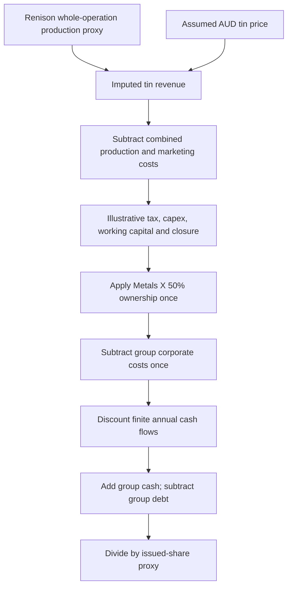

# Metals X: public worked modelling example

**ASX:MLX · AUD · input snapshot dated 20 September 2026**

This example combines reported financial history with an explicitly illustrative finite-mine cash-flow sensitivity. It demonstrates a reviewable modelling workflow. It does **not** establish a fair value, price target or investment recommendation. Read the [Markdown research summary](mlx/report.md) first; use the accompanying [Excel workbook](mlx/model.xlsx) to inspect assumptions, formulas and detailed sensitivities.

The reproducible source input is [model-mlx.json](model-mlx.json). It contains public company facts and agent-authored assumptions only. It has no portfolio, authentication material, private file paths or dependency on another user's research folders. `synthetic: false` means the historical facts are real issuer disclosures; it does **not** mean forecast assumptions are verified.

## What the evidence supports

The input preserves the original 23 operating and financial facts and adds 50 comparative financial-statement observations: **73 historical observations in total**, spanning FY2024, FY2025 and selected June 2026 quarter/TTM figures. This is selected comparative history, not a complete three-year financial database.

| AUD millions unless indicated | FY2024 | FY2025 |
|---|---:|---:|
| Revenue | 218.820 | 284.999 |
| Gross profit | 95.262 | 126.724 |
| Profit before tax | 120.227 | 138.275 |
| Net income | 102.349 | 104.605 |
| Closing cash | 220.644 | 293.606 |
| Total assets | 505.032 | 618.509 |
| Total liabilities | 77.258 | 85.976 |
| Total equity | 427.774 | 532.533 |
| Net operating cash flow | 143.567 | 128.323 |
| Net investing cash flow | (55.453) | (52.493) |
| Net financing cash flow | (10.512) | (2.868) |
| Net increase in cash | 77.602 | 72.962 |

Source: [2025 annual report](https://www.metalsx.com.au/wp-content/uploads/2026/03/MLX-Annual-Report-31-December-2025.pdf), physical PDF pages 24–26 (printed pages 23–25). FY2024 is the comparative column in that same report. Reported AUD thousands are multiplied by 1,000 in the JSON; the table above displays millions. Income-statement expense and individual capex-paid rows use positive expense magnitudes; net investing and financing cash flows retain their reported negative signs. The selected rows do not contain every income-statement line and should not be summed to reconstruct profit without the omitted lines.

Both years reconcile:

- Assets = liabilities + equity.
- Operating + investing + financing cash flow = change in cash.
- Opening cash + change in cash = closing cash.
- Revenue − cost of sales = gross profit.

These are historical transcription checks, not proof of a complete forecast or an audit of the issuer.

## Operating model and ownership

The [June 2026 quarterly report](https://www.metalsx.com.au/wp-content/uploads/2026/07/02_MLX_Quarterly-Report_30-June-2026_Final.pdf) supplies the operating starting points. These are physical PDF pages:

| Starting point | Value | Page | Treatment |
|---|---:|---:|---|
| Renison ownership | 50% | 2 | Apply once to whole-operation cash flow |
| TTM tin produced | 11,287 tonnes | 2 | Production proxy; not payable sales |
| TTM imputed tin price | A$63,760/t | 2 | LME-imputed price; not realized selling price |
| TTM C1 cost | A$19,349/t | 2 | Combine with marketing, not with AISC |
| TTM imputed sales/marketing | A$8,089/t | 2 | Includes royalties/payable-tin deductions |
| June-quarter total capex | A$23.40m | 3 | Annualize to A$93.60m as an assumption |
| June-quarter group corporate costs | A$0.56m | 8 | Annualize to A$2.24m as an assumption |
| Group closing cash | A$374.00m | 9 | June 30 balance; not current cash |

Group historical financial statements already have a consolidated ownership basis. Do not halve them again. The model's whole-operation operating inputs and consolidated statement history are different reporting bases.

## Explicit scenario assumptions

| Driver | Bear | Base | Bull |
|---|---:|---:|---:|
| Production proxy versus reported TTM | 90% | 100% | 110% |
| Imputed tin price versus reported TTM | 80% | 100% | 120% |
| Combined unit cost versus TTM | 110% | 100% | 95% |
| Discount rate | 12% | 10% | 8% |
| Assumed finite forecast horizon | 3 years | 5 years | 7 years |

All cases assume 30% tax on positive model EBIT, no depreciation tax shield, no working-capital movement, no terminal/residual value and a nominal A$100m whole-operation closure payment in the final forecast year. Separate royalties are zero because the combined marketing cost already includes them. These are agent-authored simplifications, not company guidance, verified tax forecasts or reserve-backed mine lives.

Forecast year labels begin in 2027 because the engine uses successive annual discount periods after the valuation date. There is no separately forecast 2026 stub. Varying horizon and discount rate alongside operations means the three scenarios are composite cases, not isolated price sensitivities.

## Limits that matter before using this for a decision

1. **Revenue:** replace production/imputed-price proxies with payable sales, realized price, inventory and settlement timing. Price-linked marketing behaviour is not independently modelled.
2. **Mine plan:** verify reserves, life-of-mine plan, recovery and depletion. The 3/5/7-year horizons are assumptions. No perpetuity is used to conceal missing mine-life evidence.
3. **Funding and equity bridge:** cash is dated June 2026; A$3.285m debt and 886,391,538 issued shares are dated December 2025. Refresh interim disclosures and confirm current diluted shares. Other assets are excluded, not economically worthless.
4. **Capital and closure:** annualizing one quarter is not guidance. Separate sustaining/project schedules, closure timing and other sites remain incomplete. The reported A$33.035m group rehabilitation provision is a discounted accounting estimate and is not the model's A$100m nominal whole-operation closure assumption.
5. **Statements:** this is a finite-mine operating cash-flow model with selected historical statements, not a linked income statement/balance sheet/cash-flow forecast. Its cash path excludes financing, dividends and debt maturities and must not be presented as a full liquidity forecast.
6. **Market comparison:** no verified current share quote is supplied. Reverse valuation and upside/downside versus market price are therefore unavailable.

Every numeric forecast input has a provenance record specifying units, a public source or assumption label, and rationale. `analyst-assumption://...` labels identify assumptions; they are not external sources. Editing assumptions in the workbook should produce a new reviewed model version and refreshed Markdown summary while retaining these evidence limitations.
